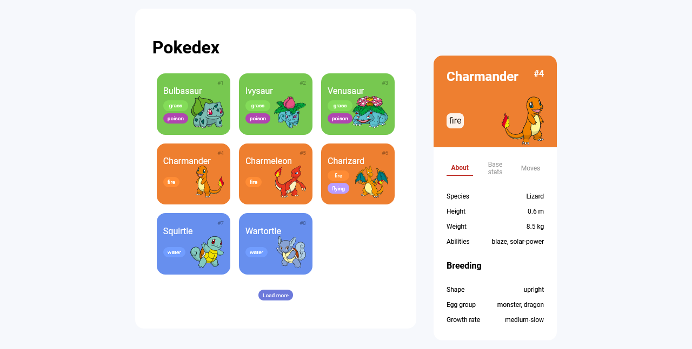
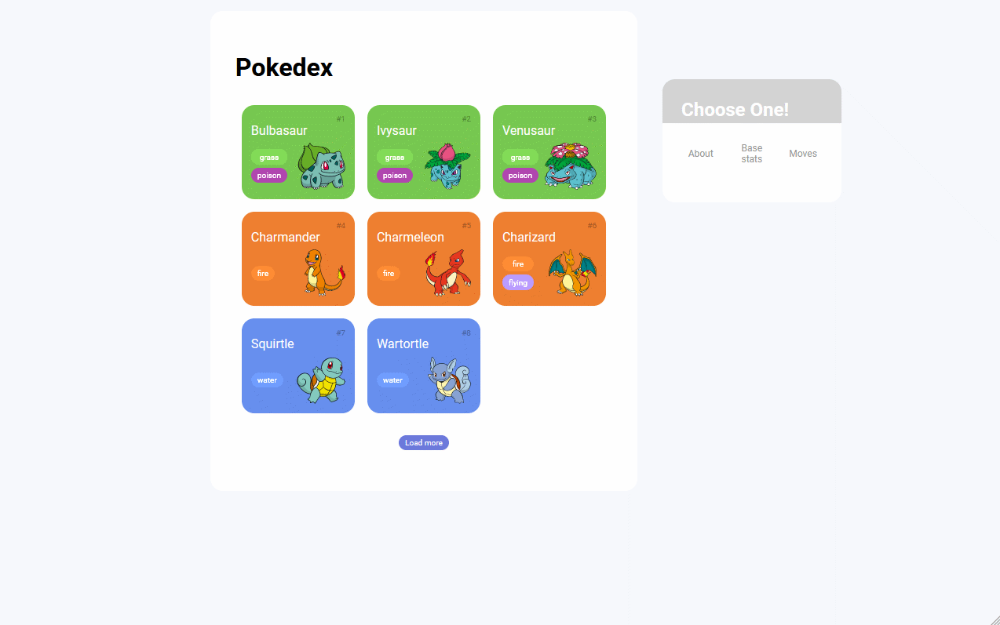

# Pokedex App

Esta é uma aplicação web simples feita no Bootcamp Santander de Java + Angular da DIO.

A aplicação permite aos usuários explorar informações sobre os Pokemons da primeira geração. Ela exibe uma lista de Pokemon e detalhes sobre cada Pokemon, como nome, tipo, habilidades e valores de stats.

**O projeto visa o aprendizado acerca da utilização de API REST**, logo, todas as consultas de dados foram feitas através da [pokeAPI](pokeapi.co/).

## Funcionalidades

- Visualizar uma lista de pokemons da primeira geração.
- Clicar em um pokemon para ver detalhes adicionais.
- Ver informações detalhadas sobre cada pokemon, incluindo sua espécie, altura, peso, habilidades, etc.
- Alternar entre informações sobre o pokemon e suas estatísticas de batalha.
- Carregar mais pokemons à medida que você rola para baixo na lista.

## Como visualizar

[Clique aqui](https://oihenrique.github.io/Santander-Bootcamp-2023-Java-Angular/HTML-CSS-JS/Pokedex-Project/) para visualizar o site funcionando.

## Tecnologias Utilizadas

- HTML5
- CSS3
- JavaScript (ES6+)

## Autor

Henrique Gomes

 [Linkedin](https://www.linkedin.com/in/oihenriquegomes/)
