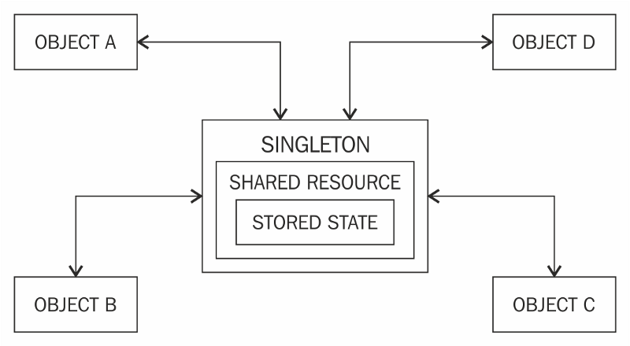
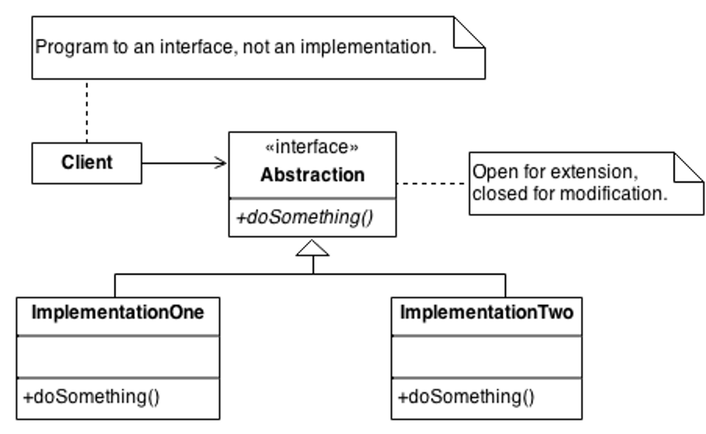
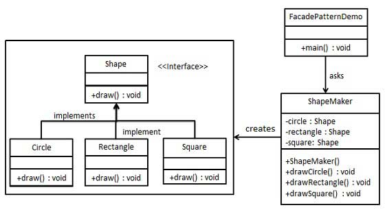

# Padrões de projetos feitos com java puro

## Padrão Singleton
O padrão Singleton garante que uma classe tenha apenas uma instância, fornece um ponto de acesso global a essa instância e tem um construtor privado para evitar a criação de múltiplas instâncias.

## Padrão strategy
O padrão Strategy permite definir uma família de algoritmos, encapsulá-los e torná-los intercambiáveis. Os clientes podem escolher o algoritmo a ser utilizado dinamicamente, sem alterar o código que os utiliza.

## Padrão facade
O padrão de projeto Facade fornece uma interface simplificada para um conjunto mais amplo de interfaces em um subsistema, tornando mais fácil de usar e ocultando a complexidade subjacente. Isso permite que os clientes interajam com o sistema de forma mais simples, sem precisar conhecer os detalhes internos do sistema.

